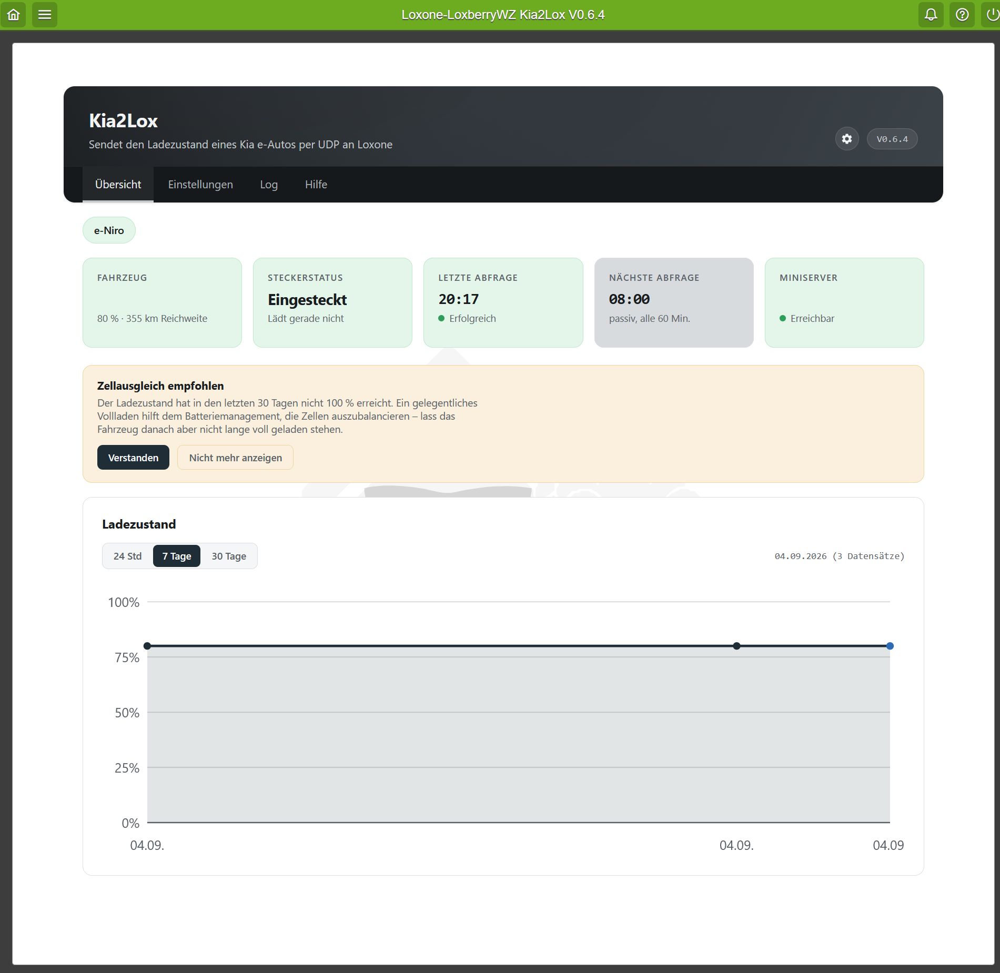
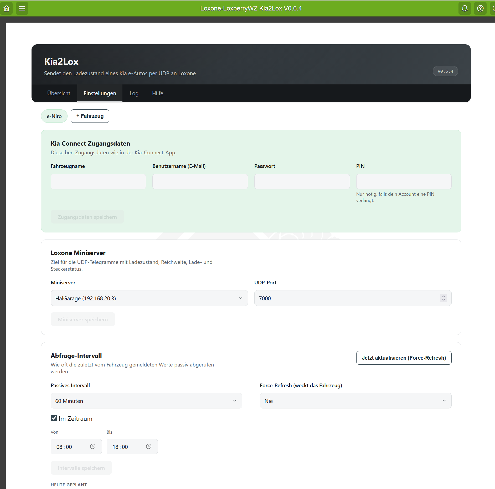
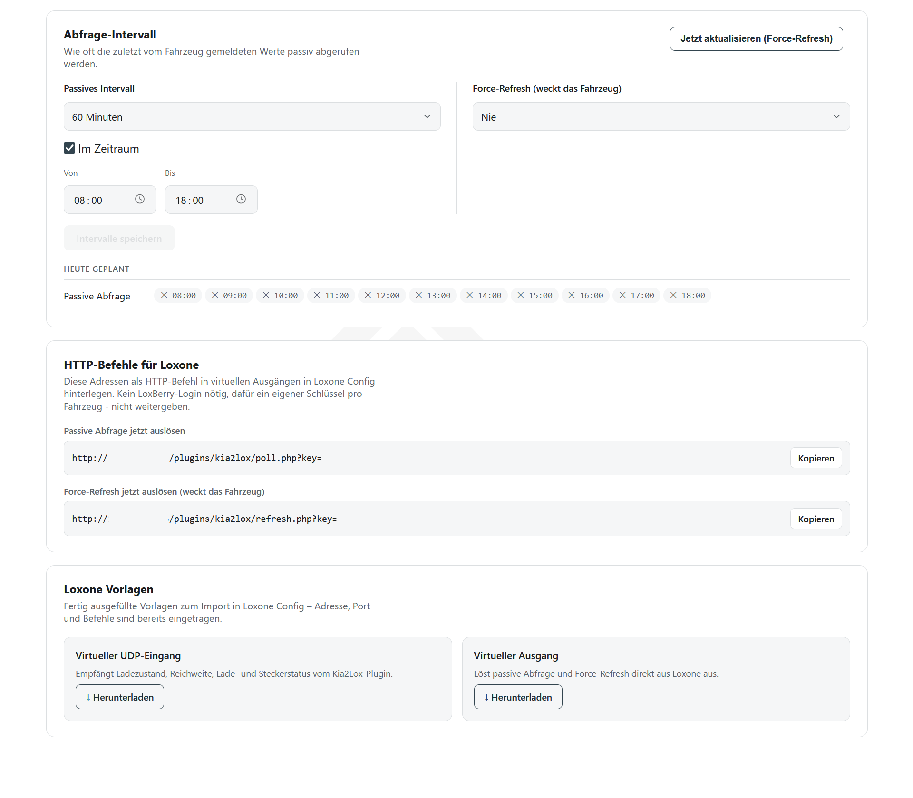

# Kia2Lox

A LoxBerry plugin that reads the charge status of a Kia (or Hyundai/Genesis)
electric vehicle via [Kia Connect](https://www.kia.com) and sends it to a
Loxone Miniserver over UDP.

Connecting to Kia Connect itself is done through the excellent
[hyundai_kia_connect_api](https://github.com/Hyundai-Kia-Connect/hyundai_kia_connect_api)
library by Fuat Akgun (MIT license) — this plugin would not exist without it.

## Features

- Supports up to 4 vehicles, each with its own Kia Connect account, Miniserver
  target and schedule
- **Passive polling**: reads the last state Kia Connect has cached, on a
  configurable interval (30–240 minutes), an optional time window, or a list
  of individual times — doesn't wake up the car
- **Force-refresh**: actively wakes the car for a fresh reading, 0–4× daily at
  fixed times, or on demand (button / HTTP trigger)
- Sends 9 values per vehicle via UDP: `SOC`, `RANGE`, `CHARGING`, `PLUGGED`,
  `FULL`, `FULLPARKED`, `RECHARGE100`, `LOWBATTERY`, `ERROR`. The four
  battery-health warnings (fully charged for 3h+, fully charged *and* idle
  on the charger for 3h+, not fully charged in 30 days, below 10% and not
  charging for 3h+) are automatically suppressed while the underlying Kia
  Connect data itself is older than that warning's own threshold, with an
  optional one-time automatic Force-Refresh to fetch current data.
  `ERROR` turns on when a poll to Kia Connect fails and clears again on the
  next successful poll
- Public HTTP endpoints (`poll.php` / `refresh.php`, key-protected per
  vehicle) to trigger a poll directly from a Loxone virtual output
- Ready-made Loxone Config import templates for the virtual UDP input and
  virtual output, pre-filled with the right address, port and key
- Overview page (the plugin's landing page) with live status cards (charge
  level, plug/charging state, last/next poll, Miniserver reachability), a
  charge-history chart, and a banner if the last Kia Connect poll failed
- Log page and an in-app help page

## Screenshots

| Overview | Settings | Settings (Intervals & Templates) |
|---|---|---|
|  |  |  |

## Installation

In the LoxBerry web interface, go to **Configuration → Plugins → Add plugin**
and enter this ZIP URL:

```
https://github.com/RiverRaid/LoxBerry-Plugin-KiaConnect/archive/refs/tags/0.8.0.zip
```

Alternatively, download that ZIP manually and install it via the "Upload
plugin archive" option. The plugin sets up its own portable Python 3.12
environment during installation, so it doesn't depend on the LoxBerry
system's Python version.

Once installed, open the plugin, add a vehicle under **Settings**, enter the
same credentials used in the Kia Connect app, and pick a Miniserver.

## Development

This project follows the official
[LoxBerry plugin structure](https://wiki.loxberry.de/entwickler/grundlagen_zur_erstellung_eines_plugins).

The [`01_test`](01_test/) directory contains a standalone script for testing
the Kia Connect connection outside of the LoxBerry plugin.

## License

[MIT](LICENSE)
